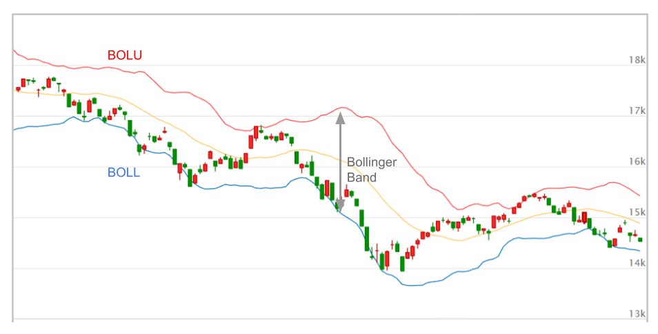

# Bollinger Band 布林通道

布林通道是用來表示股價波動範圍，確認未來走勢的趨勢線，也可以判斷超買或超賣的訊號。  

布林通道的定義由均線和標準差的概念組成，共分為三條線:  
1. 中線(middle band): 移動平均線  
2. 上線(upper band): 中線 + 2個標準差，又稱為正線、壓力線、阻力線  
3. 下線(lower band): 中線 - 2個標準差，又稱為負線、支撐線  

## 計算公式  

1. 定義 $ TP=typical\ price=(high+low+close)/3 $  
2. 計算一段時間($T_1$)價格的移動平均 $ SMA(TP,\ T_1) $  
3. 計算一段時間($T_1$)價格的標準差 $ std(TP,\ T_1) $  
4. 計算上線 $ BOLU = SMA(TP,\ T_1) + m \times  std(TP,\ T_1) $  
5. 計算下線 $ BOLL = SMA(TP,\ T_1) - m \times  std(TP,\ T_1) $  

  

## 布林通道的統計學解讀  

假設價格以常態分布，則此價格有95%的機率落在$\pm2$個標準差之間，也就是布林通道的區間內，5%的機率落在區間外。  

簡單來說，布林通道的概念認為，價格有很大的機率落在通道中間附近。  

至於價格是否真的為常態分布則需要另外研究，依照不同標的，價格的分布未必是常態分布。